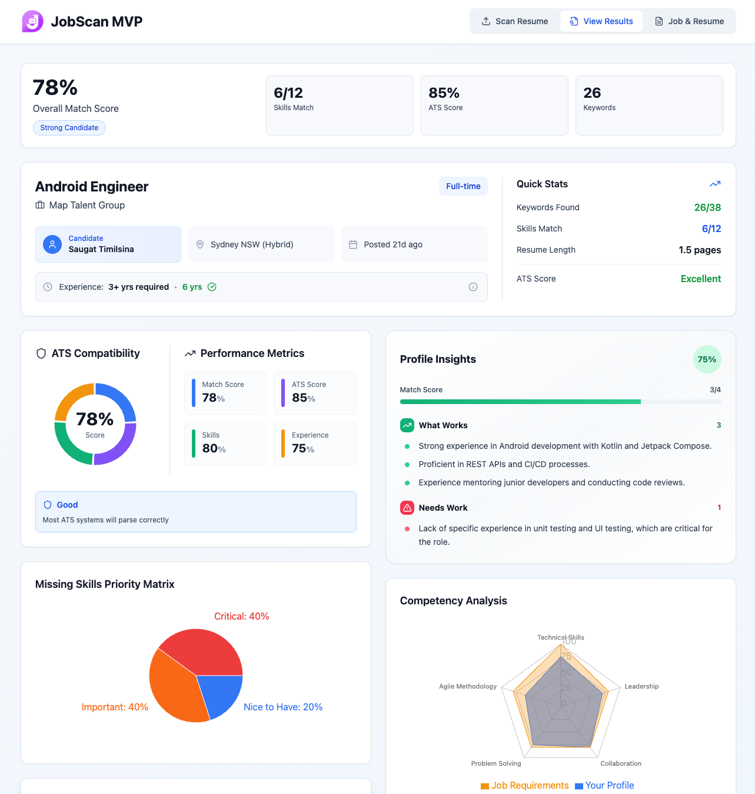
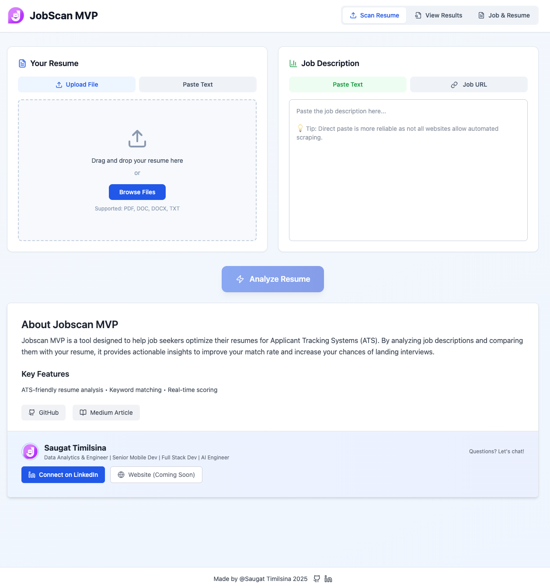
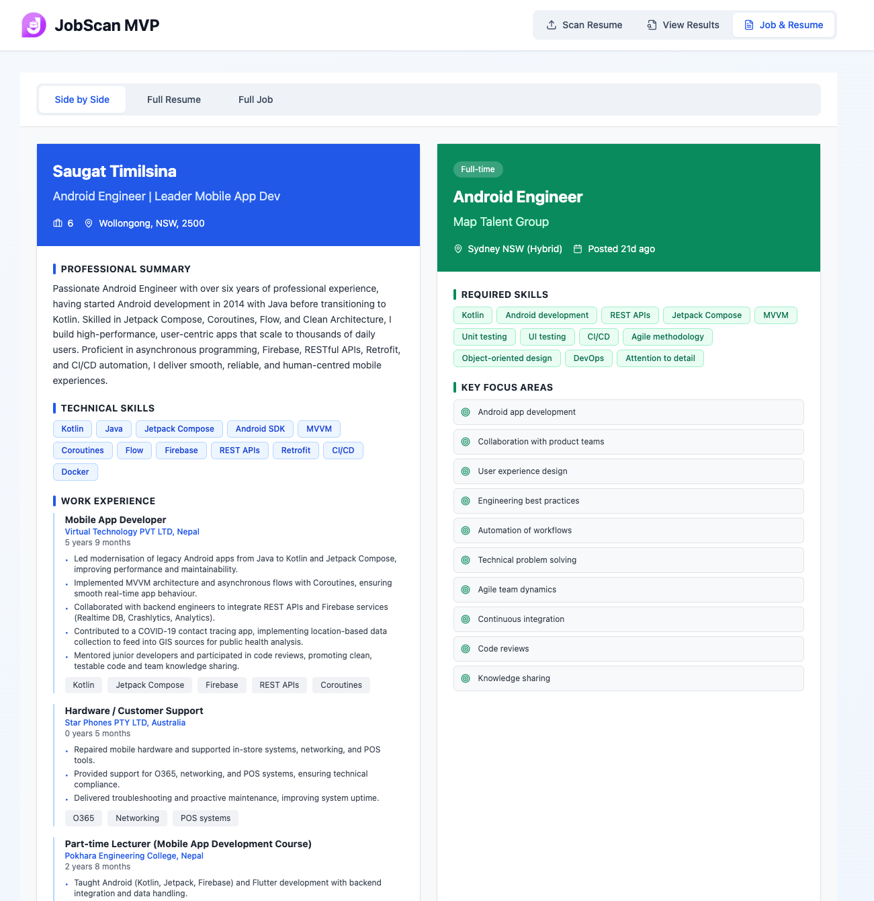
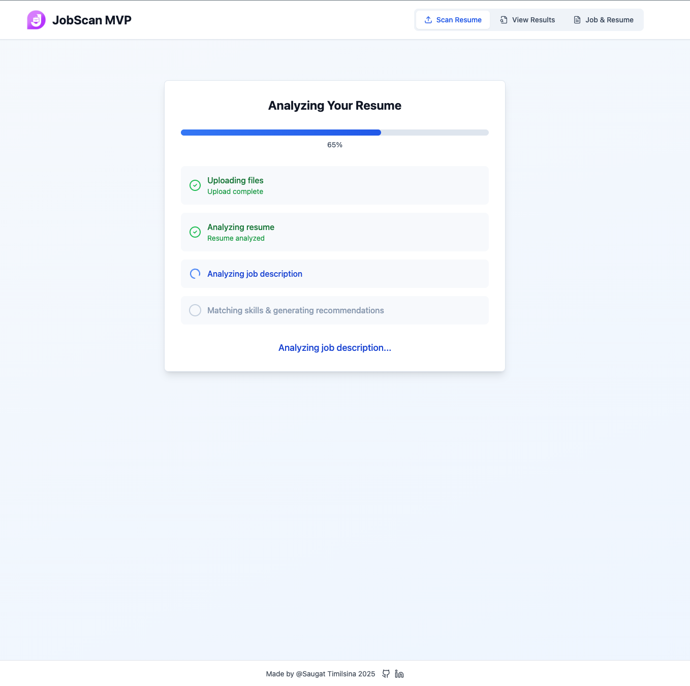
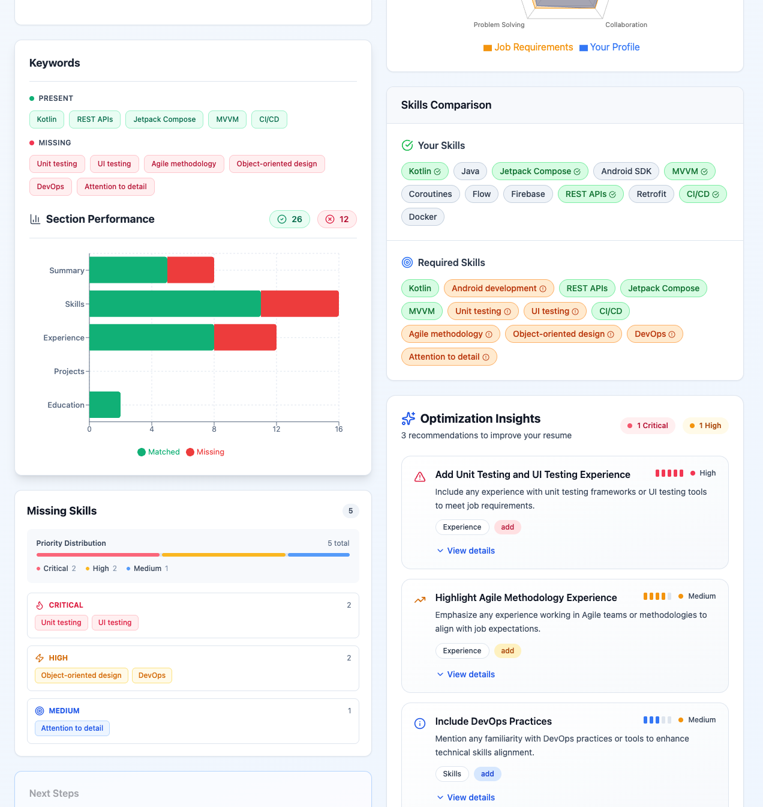

# 🧠 Jobscan MVP

Jobscan MVP is an intelligent resume optimization tool designed to help job seekers **improve their ATS (Applicant Tracking System) match rate**.  
By analyzing your resume against a job description, it provides **keyword insights**, **ATS-friendly optimization suggestions**, and **real-time scoring** to increase your chances of landing interviews.

---

## 🚀 Live Demo

You can try the **pre-release demo** hosted on **AWS EC2** here:  
👉 [http://3.27.34.4/upload](http://3.27.34.4/upload)

---

 

---

## 🚀 Key Features

- **ATS-Friendly Resume Analysis** – Detect formatting and keyword issues that may affect ATS parsing.  
- **Keyword Matching Engine** – Compare resume and job description for missing or weak skill terms.  
- **Real-Time Scoring** – Get instant match percentage between your resume and the job post.  
- **Optimization Suggestions** – Receive actionable feedback and skill recommendations powered by a RAG-based AI engine.  
- **Visual Analytics Dashboard** – Track resume performance metrics and keyword coverage visually.

---

## 🧩 Architecture Overview

Jobscan MVP follows a **microservices-based architecture**, separating the **Frontend** and **Backend (RAG-based service)** for scalability and modularity.

📦 jobscan-mvp/
│
├── frontend/ # React + Tailwind microservice
│ ├── src/
│ ├── public/
│ └── ...
│
├── backend/ # FastAPI + LangChain microservice
│ ├── app/
│ ├── models/
│ ├── routes/
│ ├── vectorstore/
│ └── ...
│
├── docker-compose.yml
└── README.md


---

## 🖥️ Frontend (Microservice)

**Tech Stack**
- React + TypeScript  
- Tailwind CSS  
- Axios (for backend API communication)  
- Recharts (for analytics visualization)  
- Lucide Icons + shadcn/ui (for clean, modern UI)

**Key Pages**
1. **Upload Page** – Upload your resume (PDF, DOCX) and input job description.  
2. **Uploading Progress** – Displays real-time parsing and analysis progress.  
3. **Job vs Resume Match Page** – Highlights matched and missing keywords.  
4. **Analytics Dashboard** – Visualizes score breakdowns and keyword distributions.

### 📸 Screenshots

| Upload & Analysis Flow | Resume vs Job Description | Analytics Dashboard |
|-------------------------|---------------------------|---------------------|
|  |  |  |
|  | |  |

---

## ⚙️ Backend (Microservice)

**Tech Stack**
- FastAPI (RESTful API service)  
- LangChain (RAG-based retrieval and reasoning)  
- Chroma Vector Store (local persistent vector DB)  
- OpenAI 
- Python Libraries: `pydantic`, `PyPDF2`, `beautifulsoup4`, `pandas`, `fastapi`, `LangChain`

**Core Functionalities**
- **Resume Extraction:** Parse and clean text from PDF/DOCX formats.  
- **Chunking & Metadata Tagging:** Split resume sections (Summary, Skills, Experience) for precise retrieval.  
- **Vector Store Creation:** Store embeddings of resume chunks for semantic search.  
- **RAG-based Comparison:** Retrieve relevant resume sections based on the job description and generate ATS match insights.  
- **JSON API Endpoints:**  
  - `/upload_resume` – Upload and parse resumes.  

---

## 🧠 RAG (Retrieval-Augmented Generation) Approach

Jobscan MVP uses an AI-driven retrieval layer for meaningful comparison:
1. **Extraction:** Extract and structure resume text and metadata.  
2. **Embedding:** Generate embeddings using a sentence transformer or OpenAI embedding API.  
3. **Retrieval:** Query the vector store with job description embeddings to find semantically similar resume sections.  
4. **Generation:** Use an LLM prompt to generate improvement suggestions, missing skills, and an ATS score.  

---

## 🧰 Setup Instructions

### 1️⃣ Clone the repository
```bash
git clone https://github.com/thesaugat/ats-resume-checker.git
cd ats-resume-checker

```

### 2️⃣ Set environment variable for backend
Create a .env file inside the backend/ folder with your OpenAI API key:
```python
OPENAI_API_KEY=your_openai_api_key_here
```
### 3️⃣ Start services using Docker Compose
```bash
docker-compose up --build
```
This will:
Build and run the backend (FastAPI + RAG services) on http://localhost:800
Build and run the frontend (React + Tailwind) on http://localhost:5173

### 4️⃣ Access the app

Open frontend: http://localhost:5173

API endpoints (if needed): http://localhost:8000/docs
 (FastAPI Swagger UI)